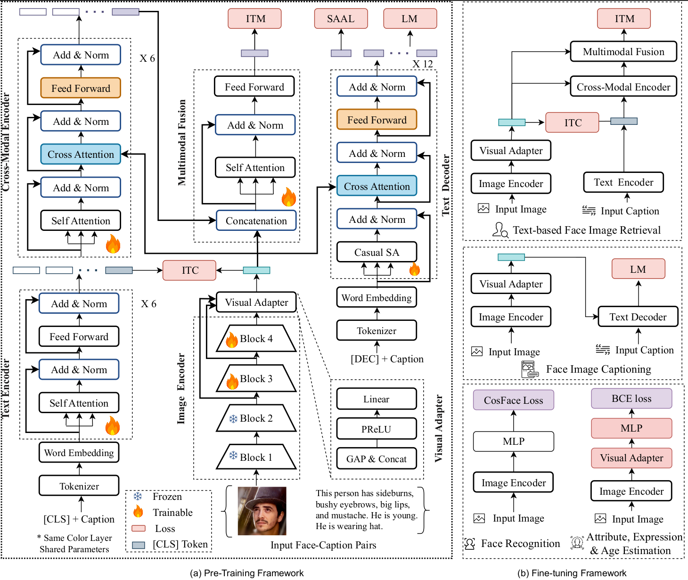
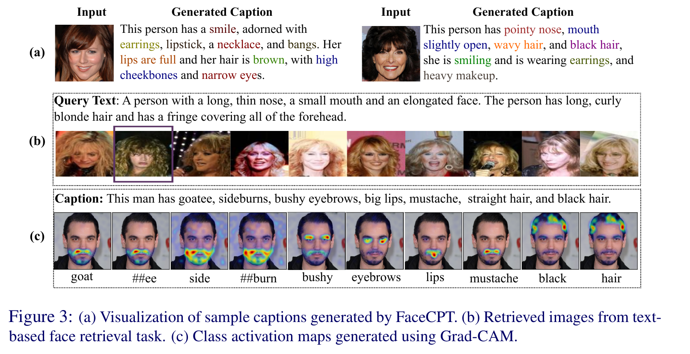

# FaceCPT: Toward Cross-Modal Facial Representation Learning with Face-Caption Pre-Training

[]()
[]()
[]()
[]()
[]()\
[Md Mahedi Hasan](https://github.com/Mahedi-61), Shoaib Meraj Sami, Nasser Nasrabadi, Jeremy Dawson\
Lane Department of Computer Science and Electrical Engineering, West Virginia University\
**British Machine Vision Conference (BMVC), 2025**

📄 [Paper (BMVA Archive, PDF)](https://bmva-archive.org.uk/bmvc/2025/assets/papers/Paper_898/paper.pdf) · 🖼️ [Poster (PDF)](https://bmva-archive.org.uk/bmvc/2025/assets/papers/Paper_898/poster.pdf) · 📝 [Citation](#citation)


---

## Overview

Most facial representation learning (FRL) methods are pre-trained for either face *generation/analysis* (face recognition, attribute recognition, expression recognition, age estimation) or general-purpose vision-language understanding — rarely both. FaceCPT poses a simple question: **can a single model, pre-trained once on web-sourced face-caption pairs, serve both cross-modal understanding (face captioning, text-based face retrieval) and single-modal face analysis tasks, even on low-resolution surveillance-style imagery?**

FaceCPT is a contrastive face-caption pre-training framework that targets exactly this. It tackles two challenges specific to face-caption data: **domain misalignment** between the visual and textual modalities, and **information asymmetry**, where a caption typically describes only a handful of attributes while the face image contains far more visual detail. FaceCPT addresses these with a combination of image-text contrastive learning, image-text matching, language modeling, and a semantic attribute-aware loss (SAAL) introduced during fine-tuning to push the model toward more distinctive, attribute-faithful captions.

The result is a single pre-trained backbone that, after lightweight task-specific fine-tuning, sets a new benchmark for **text-based face image retrieval**, is competitive with much larger, higher-resolution vision-language models on **face captioning**, and reaches near task-specific performance on **face recognition, facial attribute recognition, expression recognition, and age estimation** — all while operating on 112×112 inputs.

## Highlights

- A single pre-training foundation model for both cross-modal tasks (captioning, text-to-face retrieval) and face analysis tasks (FR, FAR, FER, age estimation).
- Pre-trained once on FaceCaption-15M and a refined FLIP-80M, then adapted to each downstream task with only moderate fine-tuning.
- A new benchmark for text-based face image retrieval, including robustness evaluation under image degradation (atmospheric turbulence) and missing/incomplete text queries.
- Semantic Attribute-Aware Loss (SAAL): a differentiable, multi-label objective that replaces CIDEr-based reward optimization, producing more attribute-guided captions and improving zero-shot retrieval.
- Outperforms FLIP and FaRL on text-based face retrieval (+1.50% / +2.11% / +0.40% R@5 on MMCelebA / Face2Text / CelebA-Dialog) while operating at 112×112 resolution versus their 224×224–-384×384 inputs.


## Architecture

<p align="center">
  
</p>

**Pre-training (left).** A ResNet (ArcFace iResNet-50/101, frozen at the lower blocks, trainable at the top two blocks) extracts a global feature and two levels of local features from an input face, which a visual adapter (GAP & Concat → Linear → PReLU → Linear) projects into a 768-d image representation. A 6-layer/12-head transformer text encoder produces a `[CLS]`-pooled caption embedding. An **image-text contrastive (ITC)** loss first aligns the two unimodal embeddings in a shared 256-d space. A 6-layer/12-head **cross-modal encoder** then fuses the two modalities via cross-attention, and a multimodal fusion block (self-attention + feed-forward) combines the fused representation with the global image feature for an **image-text matching (ITM)** loss with hard-negative mining. In parallel, a 12-layer text decoder with causal self-attention and cross-attention to the image generates captions under a **language modeling (LM)** loss, with **SAAL** applied during fine-tuning to enforce attribute fidelity.

**Fine-tuning (right).** The pre-trained encoders are re-purposed per task: image encoder + visual adapter + MLP + CosFace loss for face recognition; image encoder + visual adapter + MLP + BCE loss for attribute/expression/age estimation; image encoder + text encoder + cross-modal encoder + ITC/ITM for text-based retrieval; image encoder + text decoder + LM loss for face captioning.

## Task Coverage

FaceCPT is evaluated across two task families: **cross-modal tasks** (face image captioning, text-based face image retrieval — fine-tuned and zero-shot) and **face analysis tasks** (face recognition, facial attribute recognition, expression recognition, age estimation), consistently matching or outperforming VLP baselines (BLIP, BLIP-2, mPLUG) and FRL baselines (FaRL, FLIP, Faceptor, FaceXFormer).

## Repository Structure

```
FaceCPT/
├── configs/                    # YAML / JSON configs for pre-training, fine-tuning, and benchmarking
│   ├── pretrain.yaml           # FaceCaption-15M / FLIP-80M pre-training hyperparameters
│   ├── caption_celeba.yaml     # Caption fine-tuning on MMCelebA
│   ├── caption_celeba_text.yaml# Caption fine-tuning on CelebA-Text
│   ├── caption_face2text.yaml  # Caption fine-tuning on Face2Text
│   ├── caption_benchmark.yaml  # Zero-shot caption evaluation on LFW / CALFW / AgeDB
│   ├── retrieval_celeba.yaml   # Retrieval fine-tuning on MMCelebA
│   ├── retrieval_face2text.yaml# Retrieval fine-tuning on Face2Text
├── data/                        # Dataset loaders and preprocessing
│   ├── caption_dataset.py       # Face-caption pair loader for captioning
│   ├── retrieval_dataset.py     # Face-caption pair loader for retrieval
│   ├── flip_dataset.py          # FLIP-80M / FaceCaption-15M pre-training loader
│   ├── fr_attr_dataset.py       # Face recognition / attribute dataset loader
├── datasets/                    # Dataset root (not version-controlled — see Datasets below)
│   └── {agedb, calfw, celeba, celeba_dialog, face2text, flip, lfw, tinyface}/
├── models/                      # Network and loss definitions
│   ├── arcface.py / iresnet.py  # iResNet-50/101 image encoders (ArcFace-pretrained) + visual adapter
│   ├── facecpt_pretrain.py      # Pre-training model: ITC + ITM + LM (Fig. 2a)
│   ├── facecpt.py               # FaceCPT_Decoder: captioning fine-tuning model
│   ├── face_retrieval.py        # Retrieval fine-tuning model (ITC + ITM, GatherLayer for distributed queues)
├── misc/                         # Analysis & visualization utilities
│   ├── gradcam_vis.py            # Grad-CAM class activation maps (Fig. 3c)
├── checkpoint/                   # Place benchmark-ready checkpoints here (gitignored)
├── output/                       # Training outputs and checkpoints land here (gitignored)
├── weights/                      # Pretrained backbone weights (gitignored, see below)
├── pretrain.py                   # Stage 1: face-caption contrastive pre-training
├── train_caption.py              # Fine-tune the captioning decoder (LM + SAAL)
├── train_retrieval.py            # Fine-tune for text-based face image retrieval (ITC + ITM)
├── train_fr.py                   # Fine-tune the image encoder for face recognition (CosFace/ArcFace)
├── eval_caption_benchmark.py     # Zero-shot caption evaluation on LFW / CALFW / AgeDB
├── eval_retrieval_benchmark.py   # Retrieval evaluation (fine-tuned & zero-shot, Tables 2–3)
└── utils.py                      # Distributed training, logging helpers
```

## Installation

```bash
git clone https://github.com/Mahedi-61/FaceCPT.git
cd FaceCPT

conda create -n facecpt python=3.9
conda activate facecpt

# install PyTorch matching your CUDA version, e.g.
pip install torch torchvision --index-url https://download.pytorch.org/whl/cu118

pip install transformers timm opencv-python pandas pyyaml tqdm scikit-learn nltk evaluate pycocoevalcap ruamel.yaml
python -m nltk.downloader punkt
```

## Datasets

| Dataset | Scale | Used For | Notes |
|---|---|---|---|
| [FaceCaption-15M](https://arxiv.org/abs/2407.08515) | 15M pairs | Pre-training | RetinaFace-filtered, attribute-driven captions |
| [FLIP-80M](https://huggingface.co/datasets/FLIP-dataset/FLIP-80M) | 80M pairs | Pre-training | Web-crawled; refined to remove non-face / complex-background pairs |
| [Multi-Modal CelebA-HQ (MMCelebA)](https://github.com/weihaox/Multi-Modal-CelebA-HQ-Dataset) | 30,000 images, 10 captions/image | Caption & retrieval fine-tuning, FAR | 40 facial attributes as ground truth |
| [Face2Text](https://github.com/mtanti/face2text-dataset) | 10,559 images, 1–5 captions/image | Caption & retrieval fine-tuning | Attributes predicted via the CelebA-trained attribute model |
| [CelebA-Text](https://github.com/cripac-sjx/SEA-T2F) | — | Caption fine-tuning | Multi-caption text-to-face dataset |
| [CelebA-Dialog](https://github.com/yumingj/Talk-to-Edit) | 202,599 images, 10,177 identities | Retrieval fine-tuning, FAR | 5 fine-grained attributes per image |
| [LFW](http://vis-www.cs.umass.edu/lfw/) / [CALFW](https://arxiv.org/abs/1708.08197) / [AgeDB](https://ibug.doc.ic.ac.uk/resources/agedb/) / [CPLFW](https://arxiv.org/abs/1708.08197) / [CFP-FP](http://www.cfpw.io/) | standard splits | Zero-shot caption/retrieval, 1:1 face verification | No ground-truth captions; used for zero-shot transfer |
| [RAF-DB](http://www.whdeng.cn/RAF/model1.html) | — | Facial expression recognition | 7-class expression benchmark |

Download each dataset from its original source and place it under `datasets/<name>/`, with `image_root`/`ann_root` paths matching the corresponding YAML config in `configs/` (e.g. `datasets/celeba/images/`, `datasets/celeba/annotation/`). Update `image_root` / `ann_root` in the relevant config if your local layout differs.

## Pretrained Weights

The image encoder is initialized from **ArcFace weights pre-trained on MS1MV2**. Place these under `weights/`, named to match `models/iresnet.py`:

| Backbone | Filename |
|---|---|
| iResNet-50 | `weights/arcface_ir50_ms1mv3.pth` |
| iResNet-101 | `weights/arcface_ir101_ms1mv3.pth` |

The text encoder is initialized from the **first 6 layers** of pre-trained `bert-base-uncased`, the cross-modal encoder from its **last 6 layers** (`fusion_layer: 6` in `configs/bert_config.json`), and the text decoder is also `bert-base-uncased`-initialized with cross-attention enabled (`configs/decoder_config.json`), sharing some layers with the cross-modal encoder. 

Pre-trained FaceCPT checkpoints (after Stage-1 pre-training) are expected under `output/pretrain/` (e.g. `cp_pretrain_flip_00.pth`), and benchmark-ready fine-tuned checkpoints under `checkpoint/` (e.g. `cp_caption_celeba.pth`) — see the `pretrained:` field in each YAML config.

## Pre-training

Stage-1 contrastive pre-training on FaceCaption-15M / refined FLIP-80M, optimizing `L = L_ITC + L_ITM + L_LM` (Eq. 1):

```bash
python3 -m torch.distributed.run --nproc-per-node=2 pretrain.py \
    --config ./configs/pretrain.yaml \
    --output_dir output/pretrain
```

Key settings from `configs/pretrain.yaml`: `img_encoder: arcface_50`, `image_size: 112`, `embed_dim: 256`, `batch_size: 64`, `temp: 0.07` (ITC temperature), `queue_size: 65536`, `momentum: 0.995` (momentum distillation), AdamW with `weight_decay: 0.05`, `init_lr: 8e-5` decaying to `min_lr: 1e-6`, `max_epoch: 6`. Use `--checkpoint <path>` to resume, and `--evaluate` to run validation only.

## Fine-tuning

All commands assume they are run from the repository root.

### 1. Face image captioning

```bash
python3 train_caption.py --dataset celeba
```

`--dataset` selects the config: `celeba` (MMCelebA), `celeba_text`, or `face2text` (loads the matching `configs/caption_<dataset>.yaml`). Generation settings: `max_length: 40`, `min_length: 15`, `num_beams: 5`, prompt `"a photo of a person where "`. Add `--evaluate` to run BLEU/METEOR/ROUGE-L/CIDEr evaluation only.

### 2. Text-based face image retrieval

```bash
python3 train_retrieval.py --dataset celeba
```

`--dataset`: `celeba` (MMCelebA), `celeba_dialog`, or `face2text`. Optimizes ITC + ITM with `negative_all_rank: True` and `k_test` candidates for re-ranking (12 for MMCelebA/Face2Text fine-tuning, 256 for zero-shot benchmark evaluation). Add `--evaluate` for retrieval-only evaluation.

### 3. Face recognition

```bash
python3 train_fr.py --dataset ms1m --model_type arcface --epochs 11
```

`--dataset`: `ms1m` | `vgg`. `--model_type`: `arcface` | `cosface`. `--freeze` controls how many epochs the backbone stays frozen before fine-tuning; `--s`/`--m` set the angular-margin loss scale/margin (paper: CosFace, `s=64`, `m=0.5`). `--checkpoint_path` loads a pre-trained-stage checkpoint to fine-tune from.

### 4. Facial attribute / expression / age estimation

```bash
python3 train_attribute.py --train --dataset celeba_dialog --model_type arcface_50 --epochs 15
```

`--dataset`: `celeba_dialog` | `lfw_a`. Use `--evaluate` instead of `--train` to run evaluation only (epochs: 15 for CelebA-Dialog, 20 for LFW-A, per the paper).

## Evaluation

```bash
# Face captioning, zero-shot on LFW / CALFW / AgeDB (Table 1 style metrics)
python3 eval_caption_benchmark.py --dataset lfw

# Text-based face image retrieval, fine-tuned and zero-shot (Tables 2–3)
python3 eval_retrieval_benchmark.py --dataset celeba_text

# 1:1 face verification on benchmark FR datasets (Table 5)
python3 eval_fr_sota_benchmark.py --architecture ir_50 --dataset lfw
```

`eval_fr_sota_benchmark.py` additionally accepts `--model_type` (`arcface` | `adaface` | `magface`), `--test_file` (pair-list filename), and `--checkpoint_path`.

Grad-CAM visualizations and the task-coverage radar chart can be reproduced with `misc/gradcam_vis.py` and `misc/radar_chart.py`, respectively.

## Results

### Face image captioning (Table 1)

| Method | Visual Backbone | Res | MMCelebA B@4 / M / RL / C | Face2Text B@4 / M / RL / C | CelebA-Text B@4 / M / RL / C |
|---|---|---|---|---|---|
| BLIP-base | ViT-B/16 | 384² | 40.43 / 61.0 / 56.05 / 27.48 | 12.04 / 41.0 / 40.85 / 22.65 | 25.53 / 48.65 / 45.78 / 30.77 |
| BLIP2-OPT2.7B | ViT-g/14 | 364² | 41.90 / 54.98 / 47.72 / 26.69 | 11.92 / 39.79 / 34.13 / 22.92 | 26.02 / 49.54 / 46.71 / 23.24 |
| OFA-base | ResNet101 | 480² | 39.40 / 60.56 / 54.85 / 26.42 | 12.01 / 41.10 / 41.85 / 22.45 | 25.65 / 49.79 / 45.80 / 29.40 |
| mPLUG-base | ViT-B/16 | 384² | 42.87 / 27.93 / 54.75 / **92.09** | 12.56 / 23.03 / 40.35 / **57.54** | 28.38 / 23.14 / 41.73 / **55.48** |
| Talk2Face | – | 256² | 39.58 / 55.61 / 52.38 / 34.71 | 11.50 / 28.50 / 40.62 / 26.90 | 33.40 / 28.40 / 53.50 / 40.0 |
| **Ours (FaceCPT-R50)** | ResNet50 | **112²** | 40.54 / 61.60 / 57.50 / 30.05 | 11.50 / 41.50 / 41.86 / 22.90 | 31.38 / 51.98 / 51.74 / 30.80 |
| **Ours (FaceCPT-R101)** | ResNet101 | **112²** | **42.60** / **62.15** / **58.90** / 32.08 | **11.76** / **42.30** / **42.20** / 23.25 | **32.20** / **53.18** / **53.92** / 35.69 |

FaceCPT-R101 matches or beats VLP baselines that use 3–4× higher input resolution. mPLUG's higher CIDEr comes from CIDEr-reward fine-tuning (SCST), which tends to mimic reference captions rather than produce distinctive ones — at the cost of weaker self-retrieval performance.

### Text-based face image retrieval, fine-tuned (Table 2)

| Method | Res | CelebA-Dialog R@5 / R@10 | MMCelebA R@5 / R@10 | Face2Text R@5 / R@10 |
|---|---|---|---|---|
| CLIP | 224² | 23.42 / 42.30 | 44.06 / 59.48 | 37.89 / 52.47 |
| ALBEF | 384² | 31.38 / 47.35 | 47.51 / 61.34 | 47.22 / 59.54 |
| BLIP-base | 384² | 32.09 / 47.56 | 48.08 / 61.75 | 45.20 / 59.34 |
| mPLUG-large | 336² | 29.29 / 46.50 | 46.35 / 59.56 | 38.39 / 48.65 |
| BLIP2-OPT2.7B | 364² | 32.04 / 47.78 | 47.90 / 62.02 | **48.58** / **62.60** |
| FaRL | 224² | 32.84 / 47.90 | 47.83 / 61.70 | 46.34 / 60.27 |
| FLIP | 224² | 33.08 / 48.21 | 48.51 / 61.92 | 46.65 / 60.60 |
| **Ours (FaceCPT-R50)** | **112²** | 32.36 / 48.44 | 49.50 / 62.02 | 45.86 / 59.48 |
| **Ours (FaceCPT-R101)** | **112²** | **33.48** / **48.94** | **50.01** / **62.88** | 48.76 / 63.12 |

### Zero-shot retrieval transfer (Table 3) — fine-tuned on MMCelebA, evaluated on LFW / AgeDB

| Method | Res | LFW R@10 / R@20 | AgeDB R@10 / R@20 |
|---|---|---|---|
| BLIP-base | 384² | 4.89 / 8.27 | 5.56 / 8.51 |
| mPLUG-large | 336² | 9.52 / 11.79 | 12.30 / 15.13 |
| BLIP2-OPT2.7B | 364² | 7.85 / 12.63 | 12.88 / 15.92 |
| FaRL | 224² | 9.85 / 14.36 | 12.98 / 16.90 |
| FLIP | 224² | 9.90 / 14.47 | 13.11 / 17.06 |
| FaceCPT-R50 | 112² | 10.91 / 15.94 | 13.12 / 18.51 |
| FaceCPT-R101 | 112² | 11.25 / 16.13 | 14.06 / 20.10 |
| FaceCPT-R50 | 224² | 10.91 / 17.33 | 13.25 / 19.26 |
| **FaceCPT-R101** | **224²** | **11.56** / **16.90** | **15.21** / **21.46** |

## Qualitative Results

<p align="center">
  
</p>

(a) Captions generated directly from face images, with attribute terms color-coded. (b) Top-10 retrieved images for a free-form text query, with the ground-truth match outlined. (c) Grad-CAM class activation maps showing FaceCPT attending to the correct facial region for each generated attribute token (e.g. "goatee", "bushy", "eyebrows", "mustache").

## Citation

If you build on this work, please cite:

```bibtex
@inproceedings{hasan_2025_facecpt,
  title     = {{FaceCPT}: Toward Cross-Modal Facial Representation Learning with Face-Caption Pre-Training},
  author    = {Hasan, Md Mahedi and Sami, Shoaib Meraj and Nasrabadi, Nasser and Dawson, Jeremy M.},
  booktitle = {36th British Machine Vision Conference (BMVC)},
  year      = {2025},
  organization = {BMVA}
}
```

This work builds on our earlier text-guided face recognition research:

```bibtex
@article{hasan_2025_captionface,
  author={Hasan, Md Mahedi and Sami, Shoaib Meraj and Nasrabadi, Nasser M. and Dawson, Jeremy},
  journal={IEEE Transactions on Biometrics, Behavior, and Identity Science},
  title={Learning Multi-Scale Knowledge-Guided Features for Text-Guided Face Recognition},
  year={2025},
  volume={7},
  number={2},
  pages={195-209},
  doi={10.1109/TBIOM.2024.3466216}
}

@InProceedings{hasan_2024_tgfr,
    author    = {Hasan, Md Mahedi and Sami, Shoaib Meraj and Nasrabadi, Nasser},
    title     = {Text-Guided Face Recognition Using Multi-Granularity Cross-Modal Contrastive Learning},
    booktitle = {Proceedings of the IEEE/CVF Winter Conference on Applications of Computer Vision (WACV)},
    month     = {January},
    year      = {2024},
    pages     = {5784-5793}
}
```

## Acknowledgement

The image encoder builds on [ArcFace](https://github.com/deepinsight/insightface) (iResNet-50/101, pre-trained on MS1MV2). The text encoder, cross-modal encoder, and text decoder build on [BERT-base](https://huggingface.co/bert-base-uncased) via [Hugging Face Transformers](https://github.com/huggingface/transformers). Pre-training data is drawn from [FaceCaption-15M](https://arxiv.org/abs/2407.08515) and a refined [FLIP-80M](https://dl.acm.org/doi/10.1145/3652583.3658019).

## Contact

For questions, or issues to this repository, please open an issue on GitHub or contact [@Mahedi-61](https://github.com/Mahedi-61).
